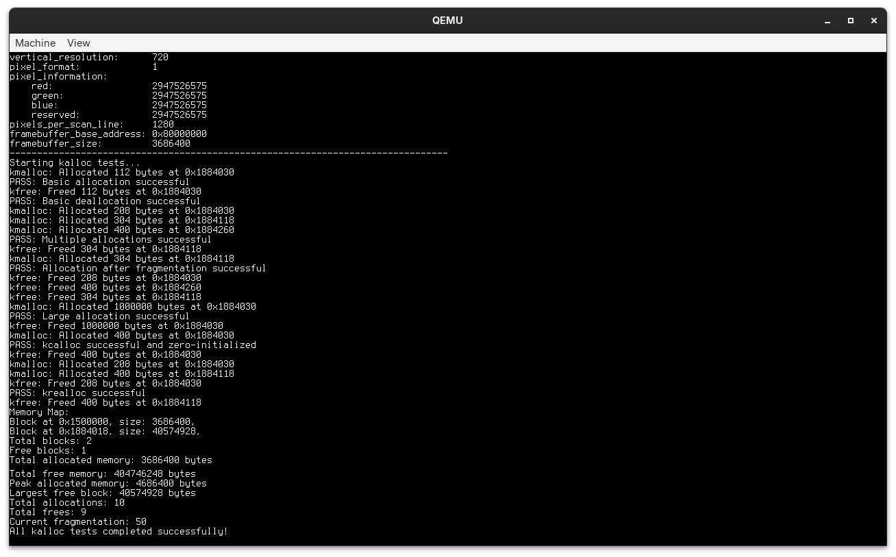

# Ink



## Building

Build the Docker image:

```bash
docker build -t ink .
```

Run the Docker container:

```bash
docker run \
    -it \
    --rm \
    --mount type=bind,source="$(pwd)",target=/ink \
    ink \
    /bin/bash
```

Compile the bootloader, kernel, and build a USB image:

```bash
make img
```

Exit the Docker container:

```bash
exit
```

Write the image to a USB drive:

```bash
sudo dd if=ink.img of=/dev/sdX bs=4M status=progress
```

or boot it in QEMU:

```bash
qemu-system-x86_64 \
  -enable-kvm \
  -cpu host \
  -chardev stdio,id=char0,logfile=serial.log,signal=off \
  -serial chardev:char0 \
  -bios bios/ovmf.fd \
  -usb \
  -hda img/ink.img \
  -net none
```